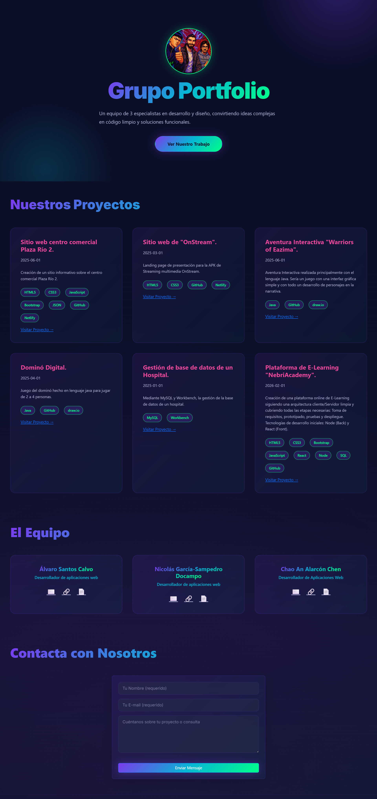

# Notas

- Añadir botón para ir hacia atrás en la confirmación de envío de formulario.

# Portfolio Grupal

Una plataforma de presentación profesional diseñada para exhibir las habilidades y proyectos de nuestro colectivo de desarrollo y diseño. Este proyecto fue construido para simular un entorno de trabajo real, utilizando un stack Node.js con un motor de plantillas para renderizado dinámico.

---

## ✨ Tecnologías Utilizadas

Este proyecto fue desarrollado utilizando un stack **Full-Stack JavaScript (MEVN/MERN-lite)** enfocado en la velocidad y el renderizado del lado del servidor.

* **Backend & Server:**
    * `Node.js`: Entorno de ejecución de JavaScript.
    * `Express.js`: Framework minimalista para el servidor web.
    * `express-handlebars`: Motor de plantillas para renderizar vistas dinámicamente (`.handlebars`).
* **Frontend & Estilo:**
    * `HTML5 / CSS3`: Marcado y estilos base.
    * `Bootstrap 5`: Framework CSS para asegurar un diseño *responsive* y moderno.
    * **Estilo Personalizado:** Esquema de colores Indigo/Coral/Teal para un look profesional y elegante.

---

## 📂 Estructura del Proyecto

La estructura sigue un patrón modular típico de aplicaciones Express con vistas separadas:

